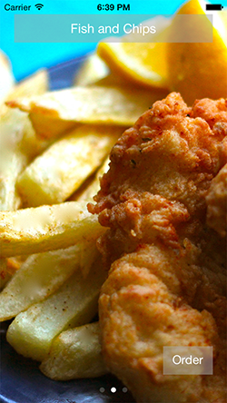

# Fuber

A quick spike to test integrating [Parse](http://www.parse.com/) (login, data model, cloud code) and [Stripe](http://www.stripe.com/) in an iOS 8 Swift project.

<table width="100%">
  <tr>
    <td align="left"></td>
    <td align="center"></td>
    <td align="right"></td>
  </td>
</table>

----------

## Resources

- https://stripe.com/docs/mobile/ios
- http://www.raywenderlich.com/30092/how-to-accept-credit-cards-in-your-ios-apps-using-stripe
- https://parse.com/docs/cloud_modules_guide#stripe
- https://github.com/ParsePlatform/ParseStore
- https://github.com/jdg/MBProgressHUD

## Todo

- Re-implement carousel to render all views up front - should solve white edge problem
- Show meal information screen (data backed)
- Save credit card details for users so they need not be re-entered